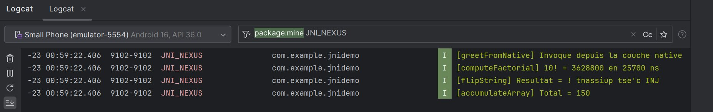
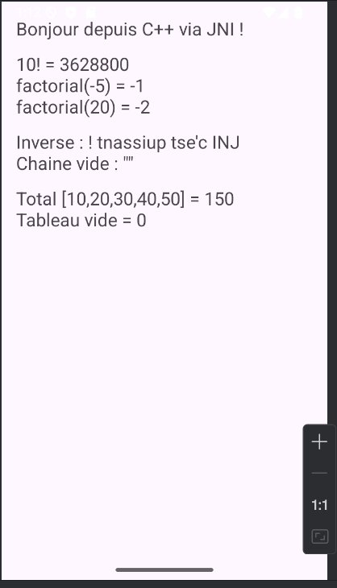
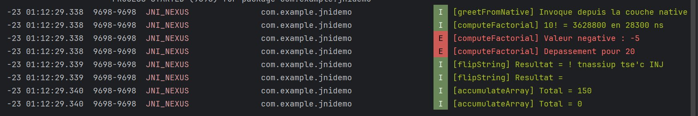
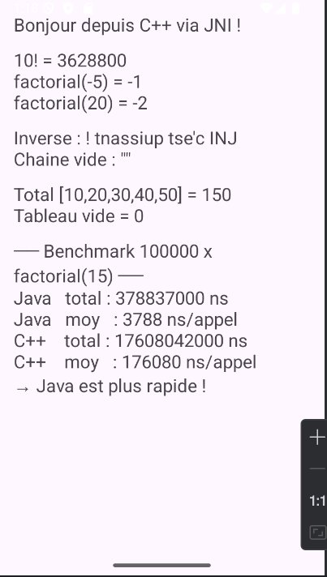
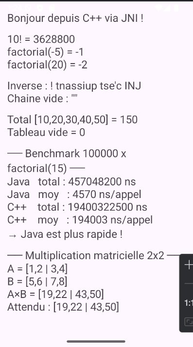
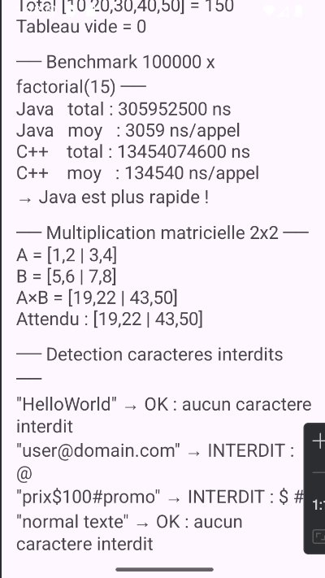
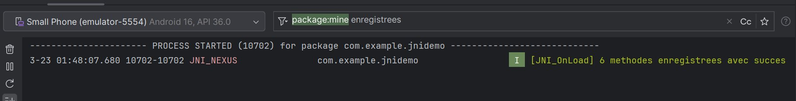

# JNIDemo — Laboratoire Android JNI avec NDK et CMake

## Présentation

**JNIDemo** est une application Android qui démontre la communication entre Java et du code natif C++ via JNI (Java Native Interface). Elle couvre les cas d'usage fondamentaux du NDK Android : passage de types simples, manipulation de chaînes, traitement de tableaux, mesure de performance, et bonnes pratiques d'architecture native.

---

## Objectifs pédagogiques

- Créer un projet Android avec support C++ (NDK + CMake)
- Comprendre le rôle de JNI, NDK, CMake et la bibliothèque `.so`
- Déclarer et appeler des méthodes natives depuis Java
- Manipuler des types simples et complexes entre Java et C++
- Gérer les erreurs fréquentes (`UnsatisfiedLinkError`, overflow, null)
- Lire les logs natifs dans Logcat
- Appliquer les bonnes pratiques JNI modernes (RegisterNatives)

---

## Architecture du projet

```
JNIDemo/
├── app/
│   └── src/
│       └── main/
│           ├── cpp/
│           │   ├── CMakeLists.txt
│           │   └── jnidemo.cpp         ← Code natif C++
│           ├── java/com/example/jnidemo/
│           │   └── MainActivity.java   ← Code Java
│           └── res/layout/
│               └── activity_main.xml   ← Interface utilisateur
```

### Flux d'exécution

```
MainActivity.java
    → appelle méthode native
    → Android charge libjnidemo.so
    → JNI_OnLoad enregistre les 6 méthodes (RegisterNatives)
    → C++ exécute le traitement
    → résultat renvoyé à Java
    → TextView mis à jour
```

---

## Prérequis

- Android Studio (version récente)
- NDK (Side by side) — installé via SDK Manager
- CMake — installé via SDK Manager
- Minimum SDK : API 24
- JDK : JetBrains Runtime 21 (intégré à Android Studio)

---

## Configuration CMake (`CMakeLists.txt`)

```cmake
cmake_minimum_required(VERSION 3.22.1)
project("jnidemo")

add_library(${CMAKE_PROJECT_NAME} SHARED jnidemo.cpp)

target_link_libraries(${CMAKE_PROJECT_NAME}
    android
    log)
```

> Le nom `jnidemo` correspond exactement à `System.loadLibrary("jnidemo")` dans Java.

---

## Fonctions natives implémentées

| Fonction Java | Implémentation C++ | Description |
|---|---|---|
| `greetFromNative()` | `impl_greetFromNative` | Retourne une chaîne depuis C++ |
| `computeFactorial(int)` | `impl_computeFactorial` | Calcul factoriel avec mesure de temps |
| `flipString(String)` | `impl_flipString` | Inversion d'une chaîne |
| `accumulateArray(int[])` | `impl_accumulateArray` | Somme d'un tableau int[] |
| `multiplyMatrices(int[], int[], int)` | `impl_multiplyMatrices` | Multiplication matricielle NxN |
| `detectForbiddenChars(String)` | `impl_detectForbiddenChars` | Détection de caractères interdits |


---

## Étape 8 — Résultat de base (4 fonctions JNI)

### Écran


### Logcat



---

## Étape 10 — Tests guidés

| Test | Appel | Résultat attendu | Statut |
|---|---|---|---|
| Valeur normale | `computeFactorial(10)` | `3628800` | ✅ |
| Valeur négative | `computeFactorial(-5)` | `-1` | ✅ |
| Dépassement int | `computeFactorial(20)` | `-2` | ✅ |
| Chaîne vide | `flipString("")` | `""` | ✅ |
| Tableau vide | `accumulateArray([])` | `0` | ✅ |

### Écran — Tests limites



### Logcat — Tests limites (logs I et E distincts)



---

## Extension C — Benchmark Java vs C++

Compare 100 000 appels de `computeFactorial(15)` entre Java pur et C++ via JNI.

**Résultat clé** : Java est ~46x plus rapide sur des appels répétés car chaque transition JNI a un coût fixe élevé (~170 000 ns). Cela confirme la recommandation Android : **minimiser les allers-retours Java ↔ natif**.

### Écran — Benchmark



---

## Extension A — Multiplication matricielle native

Envoi de deux matrices aplaties (`int[]`) vers C++, multiplication NxN en natif, retour du résultat.

```
A = [1,2 | 3,4]  ×  B = [5,6 | 7,8]  =  [19,22 | 43,50]
```

### Écran — Multiplication matricielle



---

## Extension B — Détection de caractères interdits

Vérification en C++ si une chaîne contient les caractères `@`, `#`, `$`, `%`, `!`. Retourne `OK` ou `INTERDIT : <liste>`.

### Écran — Détection de caractères interdits



---

## Extension D — RegisterNatives

Au lieu des longs noms `Java_com_example_jnidemo_MainActivity_...`, les fonctions sont enregistrées explicitement au démarrage via `JNI_OnLoad` :

```cpp
static JNINativeMethod gMethodTable[] = {
    {"greetFromNative",      "()Ljava/lang/String;",                    (void*) impl_greetFromNative},
    {"computeFactorial",     "(I)I",                                    (void*) impl_computeFactorial},
    {"flipString",           "(Ljava/lang/String;)Ljava/lang/String;",  (void*) impl_flipString},
    {"accumulateArray",      "([I)I",                                   (void*) impl_accumulateArray},
    {"multiplyMatrices",     "([I[II)[I",                               (void*) impl_multiplyMatrices},
    {"detectForbiddenChars", "(Ljava/lang/String;)Ljava/lang/String;",  (void*) impl_detectForbiddenChars},
};
```

**Avantages** : plus rapide au chargement, résistant aux renommages de package, code C++ plus lisible.

### Logcat — RegisterNatives (6 méthodes enregistrées)



---

## Bonnes pratiques appliquées

- Libération systématique des ressources JNI (`ReleaseStringUTFChars`, `ReleaseIntArrayElements`)
- Gestion des cas d'erreur (null, overflow, valeur négative)
- Logs distincts `LOGI` (succès) et `LOGE` (erreur) avec tag unique `JNI_NEXUS`
- Mesure de performance native avec `std::chrono`
- Architecture `RegisterNatives` pour un code plus propre et plus rapide
- Minimisation des allers-retours Java ↔ natif (leçon du benchmark)


---

## Quand utiliser JNI ?

JNI est pertinent pour :
- **Calcul intensif** : traitement d'image, chiffrement, moteur de jeu
- **Réutilisation** de bibliothèques C/C++ existantes (OpenCV, etc.)
- **Protection partielle** de logique sensible
- **Interaction bas niveau** avec les API natives Android

JNI n'est **pas adapté** pour des petits appels répétés — le benchmark le démontre clairement.
